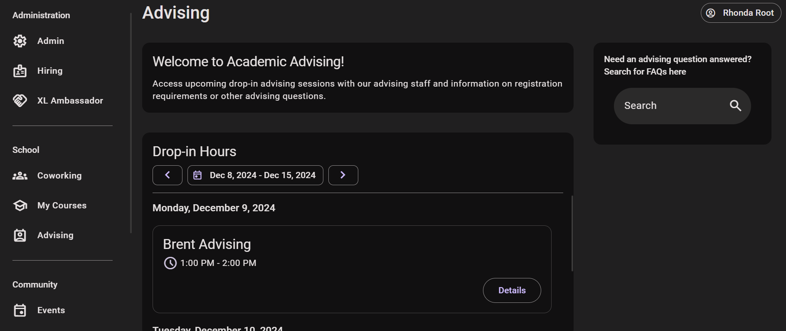
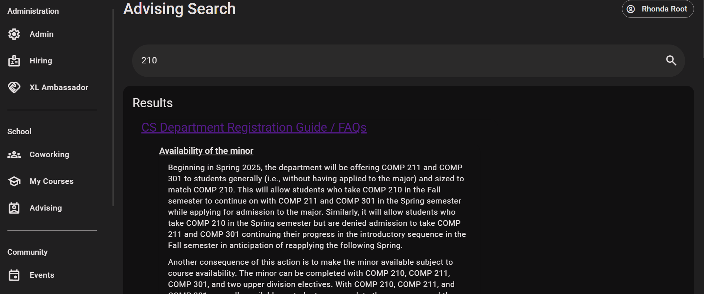
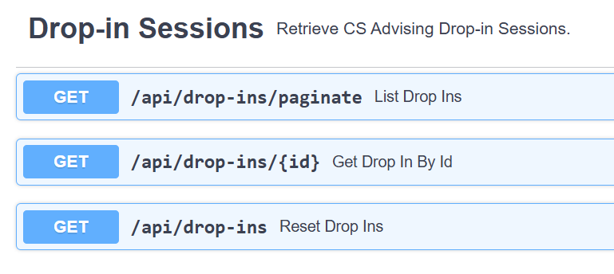
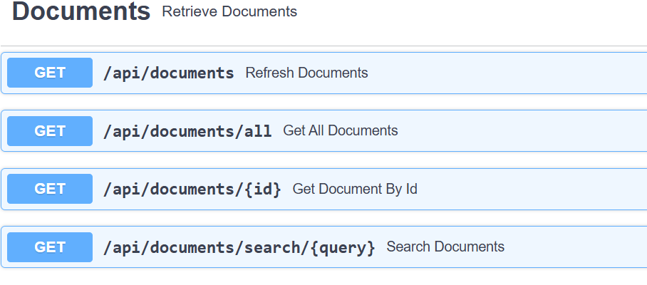
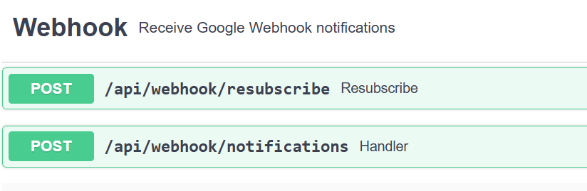

# Academic Advising Feature Technical Specification

> Written by [Emma Foster](https://github.com/emmalynfoster) for the CSXL Web Application.<br> _Last Updated: 12/8/2024_

This document contains the technical specifications for the Academic Advising feature of the CSXL web application. This feature adds _4_ new database tables, _10_ new API routes, and _4_ new frontend components to the application.

The Academic Advising feature allows students to access drop-in advising sessions hosted by advisors from the CSXL Advising page. It also allows students to search the Registration Guide for information, while also allowing the possiblity of more documents to be added to the search. 
The web application can now store advising session from Google Calendar and Documents from the Advising Google Drive folder. 

All authenticated visitors to the CSXL website have access to the Advising page, where they will see the drop-in hours and the search bar for advising documents. Drop-in sessions and any document information are only editable from the Google Resources, given an editor has permissions for that resource. 
As our feature is an integration with Google APIs, all editing must be done for Google Workspace. 

## Table of Contents

* [Frontend Features](#FrontendFeatures)

## Frontend Features<a name='FrontendFeatures'></a>

The frontend features add _4_ new Angular components, all at the `/advising` route.

### User Features<a name='UserFeatures'></a>

The following pages have been added and are available for all authenticated users of the CSXL site. These pages are ultimately powered by new Angular service functions connected to new backend APIs.

#### Advising Page<a name='AdvisingPage'></a>



The Advising page is available on the side navigation toolbar at `/advising`. This page shows the drop-in sessions and the search widget for searching advising documents. All users, Admin, Students, Ambassadors, etc. have the same permissions and view of the Advising page. 

In the future, this page will include the option for users to add reminders of upcoming drop-in sessions they plan on attending. This component will only be available to students. 



### Conclusion<a name='Conclusion'></a>

In total, the following components have been added:

| Name                     | Route                         | Description                                              |
| ------------------------ | ----------------------------- | -------------------------------------------------------- |
| **Advising Page**        | `/advising`                   | Main page for viewing all Advising features              |
| **Drop-in Sessions**     | `/advising`                   | Displays all available drop-in sessions from Google API  |
| **Drop-in Card Widget**  | `/advising`                   | Displays an individual drop-in session and links to event|
| **Search Page**          | `/advising-search`            | Search functionality to display results by section       |

## Backend Design and Implementation<a name='BackendDesignandImplementation'></a>
The academics feature ultimately adds _4_ new database tables and _10_ new API routes.

### Entity Design<a name='EntityDesign'></a>

The Academic Advising Feature adds four new database tables and entities. They are as follows:

| Table Name             | Entity                 | Description                                                |
| ---------------------- | ---------------------- | ---------------------------------------------------------- |
| `document`             | `DocumentEntity`       | Stores documents from Google Drive and its parsed sections |
| `section`              | `DocumentSectionEntity`| Stores document sections and indexed content               |
| `drop_in`              | `DropInEntity`         | Stores drop-in sessions                                    |
| `drop_in_reminder`     | `DropInReminderEntity` | Stores a session a user adds to reminders                  |

The fields and relationships between these entities are shown below:

### Document Entity Relationships


The `DocumentEntity` and `DocumentSectionEntity` have a one-to-many relationship, where the documents store parsed markdown sections and indexed content for consistent UI and organization. 
This allows us to display relevant content in sections, rather than large chunks of document text. 

### Drop-in Entity Relationships


The DropInReminder serves as an association table for the many-to-many relationship between the `UserEntity` and the `DropInEntity` in order for students to save 
reminders to the advising page. This feature has not yet been implemented.

### Pydantic Model Implementation<a name='PydanticModelImplementation'></a>

The Pydantic models for the document and drop-in features are nearly one-to-one with their entity counterparts, but the one-to-many relationship bewteen documents and document sections requires a details model. 

<table>
<tr><th width="520">`DropIn` and `DropInReminder` Models</th></tr>
<tr>
<td>
 
```py

class DropIn(BaseModel):
    id: int | None = None
    title: str
    start: datetime
    end: datetime
    link: str


class NewDropInReminder(BaseModel):
    drop_in_id: int
    user_id: int


class DropInReminder(NewDropInReminder):
    drop_in: DropIn
    user: User

```
</td>
</tr>
</table>

<table>
<tr><th width="520">`Document`, `DocumentDetails`, and `DocumentSection` Models</th></tr>
<tr>
<td>
 
```py

class Document(BaseModel):
    id: int
    title: str
    link: str

class DocumentDetails(Document):
    sections: list[DocumentSection]

class DocumentSection(BaseModel):
    id: int
    title: str
    content: str
    document_id: int
```
</td>
</tr>
</table>

### API Implementation<a name='APIImplementation'></a>

The Academics feature adds 10 new API routes to handle populating our database, retrieving drop-in sessions, documents, and document sections, and managing webhooks. 
We use our APIs differently than usual, where some are specifically written for the CloudApps deployment use, rather than making CRUD operations on our resources. 

Here is a summary of the APIs added:

#### Drop-in APIs



#### Document APIs



#### Webhook APIs



### API Function Summary<a name='APIFunctionSummary'></a>
All API routes except for drop-in pagination are not necessarily checked for permissions, as the Advising page is not accessible without authentication. All of this information is public information. 

**Relies on Document Service**

| Service Function | Resource | Description | 
| ---------------- | -------- | ----------- |
| `refresh_documents`  | `"documents"` | Deletes all document entries and repopulates them from the Google Drive folder |
| `all`                | `"documents/all"` | Gets all documents | 
| `get_document_by_id` | `"documents/{id}` | Gets a document by ID for the purposes of sorting sections by associated document ID |
| `search_document_sections` | `"documents/search/{query}"` | Searches indexed content of each document section for most relevant information |

**Relies on Drop-in Service**

| Service Function | Resource | Description | 
| ---------------- | -------- | ----------- |
| `get_paginated_drop_ins`  | `"drop-ins/paginate"` | Gets a paginated list to display drop-ins on the Advising page if user is authenticated |
| `get_by_id`                | `"drop-ins/{id}"` | Gets a drop-in by ID for displaying pagination | 
| `reset_drop_ins` | `"drop-ins` | Deletes all drop-in entries and repopulates them from Google Calendar, either from webhook or CloudApps |

**Relies on Webhook Service**

This service is not related to an entity, but receives notifications of updates to our watched resources in Google Drive and Google Calendar, then subsequently updates the information in the database. 

| Service Function | Resource | Description | 
| ---------------- | -------- | ----------- |
| `subscribe_to_document_and_calendar_changes`  | `"webhook/resubscribe"` | Used by CloudApps to resubscribe to the webhook every 28 days  |
| `notification_handler`                | `"webhook/notifications"` | Refreshes databased based on uuid of resource that changed, either drop-ins or documents | 


